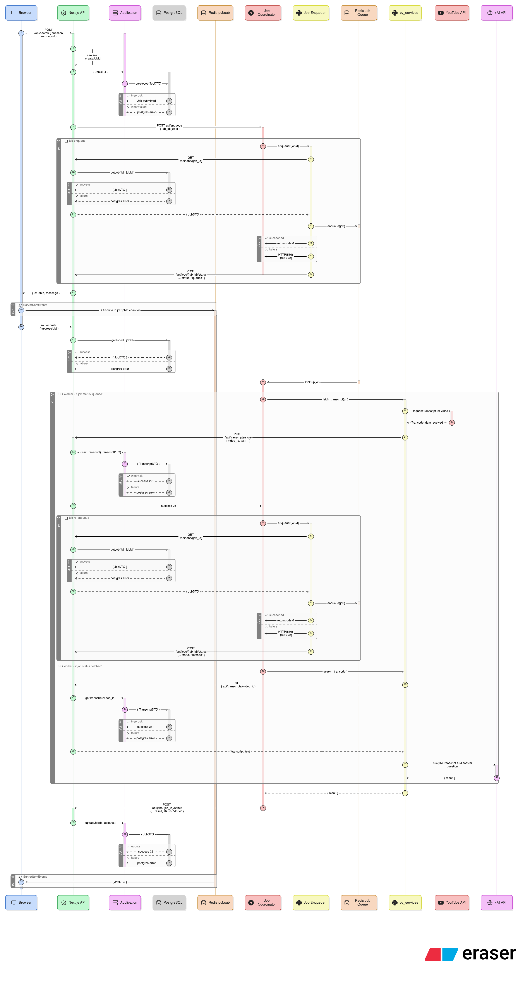
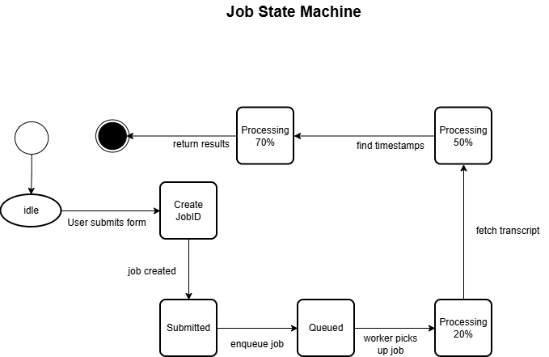
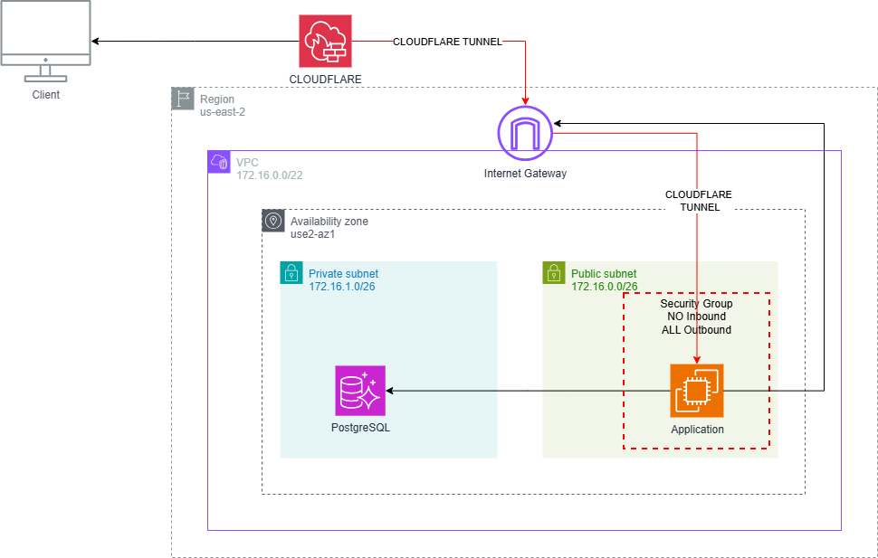

# Transcriptor

Transcriptor finds the exact timestamps of user-defined keywords or concepts inside long-form YouTube content leveraging AI.<br>
E.g., "Where does the discussion about _______ begin?"  |  "What were the names of the books discussed?"

**Live app:** [transcriptor.ca](https://transcriptor.ca)

---

## What It Does

Paste a YouTube URL, ask a question or describe a concept, and Transcriptor returns the precise timestamps in the video where that topic appears. Built for researchers, students, and anyone who doesn't want to scrub through a 3-hour video to find one moment.

---

## Architecture Overview

Transcriptor is a full-stack application with a decoupled Python service layer for transcript processing. Jobs are processed asynchronously — the client receives real-time progress updates via Server-Sent Events (SSE) streamed through a Redis pub/sub channel.

### Request Flow

```
User submits URL + question
\_
   Next.js API creates job (status: submitted) → Postgres
   \_     
      Python Enqueuer submits job to Redis Queue (RQ)
      \_        
        Python RQ Worker executes job:
                - Fetches YouTube transcript
                - Caches transcript in Postgres
                - Sends transcript + question to xAI Grok
                - Publishes progress events to Redis pub/sub
                
        Next.js SSE endpoint streams events back to client in real time
   _/            
Client receives timestamped results
```

### Job State Machine

Jobs flow through the following states:

```
submitted → queued → processing → done
                               ↘ error
```

A **Reconciler** service can re-enqueues any `submitted` or `queued` jobs from Postgres on Redis restart, ensuring no jobs are lost if Redis goes down without persistence. This is a feature to be implemented in future.

### Transcript Caching

Transcripts are fetched once and stored in Postgres. Repeat queries against the same video skip the fetch step entirely — reducing latency and external API calls.

---

## Diagrams

<details>
<summary> API Flow (large image)</summary>

</details>

<details>
<summary>Job Coordinator State Machine</summary>

</details>

<details>
<summary>AWS Architecture</summary>

</details>
---

## Tech Stack

| Layer | Technology |
|---|---|
| Frontend | Next.js 16, React 19, TypeScript, Tailwind CSS |
| Backend  | Next.js Routes, Python + Redis Queues |
| AI | xAI Grok |
| Database | PostgreSQL |
| Real-time | Server-Sent Events (SSE) via Redis pub/sub |
| Infrastructure | AWS |

---

## Design Decisions

**Decoupled Job Coordination service**

The approach to job coordination was to allow for serverless in future. In addition, separating the concern of submitting 
and executing jobs is important in software design. When researching some tech candidates, I really liked the simplicity and horizontal scalability of RQ workers for this system, which is not complex.

**Why Redis Queue instead of a managed queue (e.g. SQS)?**

This consideration was for cost as well as an opportunity to use redis in a project. For a self-hosted setup on AWS, RQ gives full control over job execution with minimal overhead. As above, the API is super simple to use, and since we are not using a redis cluster, we leverage the multi-index setup where one redis URL is for pub/sub, the other for worker queue:<br>
        `REDIS_URL=redis://localhost:6379/0         #(pub/sub)`<br>
        `REDIS_QUEUE_URL=redis://localhost:6379/1   #(RQ)`<br>

**Why SSE instead of WebSockets?**

Since the client is concerned only with Job progres, we know that event update should be unidirectional where the server pushes updates and the client only listens. Websockets would have required a persistent bidirectional TCP connection and it felt overkill for our requirements. The system uses Redis pub/sub as the messaging backbone, with Next.js API routes handling SSE streams and a custom React hook managing client-side connections. Then our pub/sub layer bridges the Python worker and the Next.js SSE endpoint.

1. User submits job → 2. Job created (queued) → 3. Client opens SSE → 4. Server subscribes to Redis → 5. Job processing publishes updates → 6. SSE sends events → 7. Client updates UI → 8. Job done → 9. Connections close

**Caching attempt**

To save on computation and to insert some caching layer, we save transcripts by `video_id` so that any repeat query against the same video is served from the DB. This was something I realized in testing and it also provides a start for future features that may require collecting anything fetched. We get a slight reduction in latency..

---

## Project Structure

```
/
├── app/                    # Next.js app router
│   ├── api/                # API routes (jobs, transcripts, SSE)
│   ├── components/         # Shared React components
│   ├── result/             # Result page
│   └── ui/                 # UI primitives
├── lib/
│   ├── db.ts               # Postgres client
│   ├── dto.ts              # Data transfer objects
│   ├── redis-pubsub.ts     # Redis pub/sub logic
│   ├── schema.sql          # Database schema
│   ├── types.ts            # Shared TypeScript types
│   ├── hooks/              # React hooks
│   └── services/
│       ├── py_services/    # Python AI + transcript logic
│       └── job_coordinator/ # RQ worker, enqueuer, reconciler
├── biome.json              # Linter + formatter config
└── package.json
```

---

## Environment Variables

```bash
# xAI
XAI_API_KEY=
XAI_BASE_URL=
XAI_MODEL=

# Database (placed in separate .env at top of dir)
DATABASE_URL=

# Redis
REDIS_URL=
REDIS_QUEUE_URL=

# App
API_BASE_URL=
ENQUEUER_PATH=lib/services/job_coordinator/enqueuer.py

#Residential IP Proxy
PROXY=
PROXY_AUTH=
```

---

## Local Development

### Prerequisites
- Node.js 20+
- Python 3.11+
- PostgreSQL
- Redis

### Setup

```bash
# Install JS dependencies
npm install

# Create virtual environment from within lib/services
python3 -m venv venv
pip install -r requirements.txt

# Set up database
psql -U postgres -f lib/schema.sql

# Copy and fill in environment variables
cp .env.example .env
```

### Run

```bash
# Next.js dev server
npm run dev

# redis server
redis-server --loglevel verbose

#Activate python venv (from transcript-prototype/proto): 
source lib/services/venv/bin/activate

# Python RQ worker (separate terminal)
python -m lib.services.job_coordinator.worker

# Python fastapi (separate terminal)
uvicorn lib.services.job_coordinator.coordinator_api:app --host 0.0.0.0 --port 8000
```